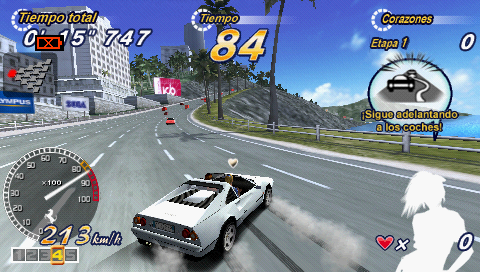
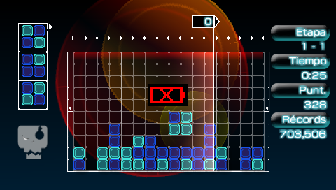

# Battery_icon

## About

This plugin will show a blinking low battery indicator. It works by hooking the `sceDisplay` syscall and patching `sceDisplaySetFrameBuffer()`,
instead of simply modifying the content of the buffer (flickering may show up). It was an exercise for learning how to use PSPSDK,
as well as a way to practice C. For that matter, I have used code for other projects as a way to understand what I was doing.

Some options can be changed on the .ini file, which must be on the same folder with the plugin. If the file cannot be found, it will be generated automatically.

PSPSDK needs to be installed for building, run `make` and you are ready to go!

## Installation

Put battery_icon.prx and battery_icon.ini in the seplugins directory on your PSP Memory Stick.

#### On ARK

Open PLUGINS.txt in the same seplugins folder and append this line to the text file:
`all, ms0:/seplugins/battery_icon.prx, on`

For PSP Go, add this line instead:
`all, ef0:/seplugins/battery_icon.prx, on`

Reboot your PSP to take effect.

#### Other CFW

Open game.txt, vsh.txt, pops.txt in the same seplugins folder and append this line to the text files:
`ms0:/seplugins/battery_icon.prx 1`

For PSP Go, add this line instead to the text files:
`ef0:/seplugins/battery_icon.prx 1`

Reboot your PSP to take effect.

## Screenshots

## Cool projects used for research

- [PSPSDK](https://github.com/pspdev/pspsdk) sample projects.
- [PSP-HUD](https://github.com/ErikPshat/PSP-HUD)
- [Brightness-Control](https://github.com/PSP-Archive/Brightness-Control)
- [ARK-4 VSH Menu](https://github.com/PSP-Archive/ARK-4/blob/main/extras/menus/vshmenu/)
- [Missyhud.prx](https://github.com/pebeto/missyhud.prx)
- [ctrlHook](https://github.com/Operation-DITTO/ctrlHook)

## Documentation

- [PSPSDK](https://pspdev.github.io/pspsdk/index.html)
- [PSPLibDoc](https://spenon-dev.github.io/PSPLibDoc/)
- [PSP Dev Wiki](https://psdevwiki.com/pspprxlibraries/) (source from the [PSP-PRX-Libraries-Documentation-Project](https://github.com/mathieulh/PSP-PRX-Libraries-Documentation-Project))

## Thanks to

- [Gamebrew](https://www.gamebrew.org/wiki/Category:PSP_plugins) for being my starting point.
- uOFW Team for the hooking libraries (see [LICENSE_uOFW](licenses/LICENSE_uOFW)).
- hiroi01 for [INI Library Portable](https://github.com/hiroi01/iniLibraryPortable) (see [LICENSE_libinip](licenses/LICENSE_libinip)).
- PSP Homebrew Community [Discord](https://discord.com/channels/479828644970364928/479828708803477505/479829773477216256) for helping out.
- Everyone who makes homebrew possible!

## LICENSE

Do whatever you want with my code as long as you credit me!
